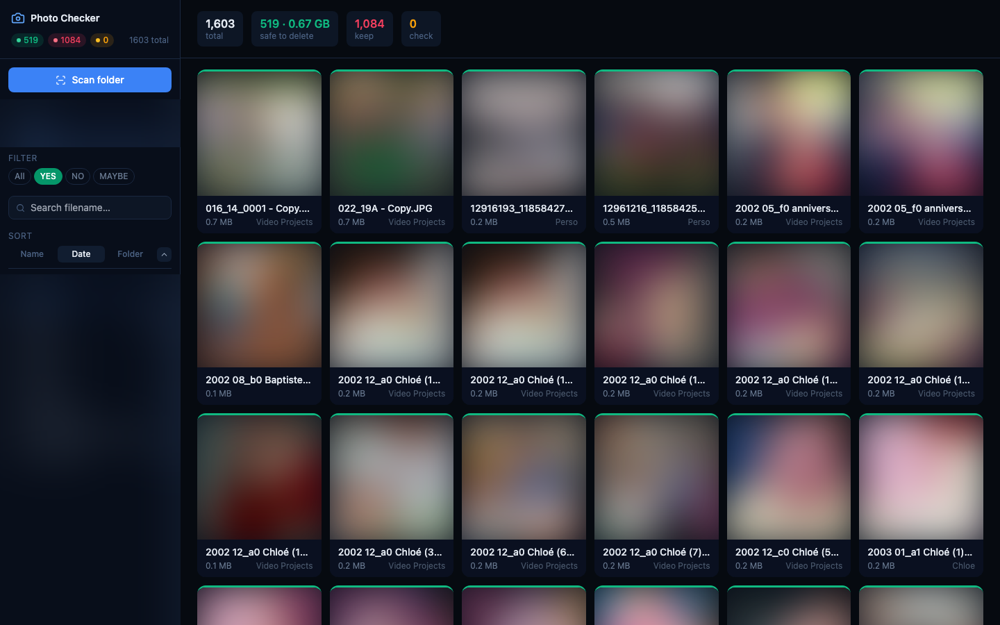
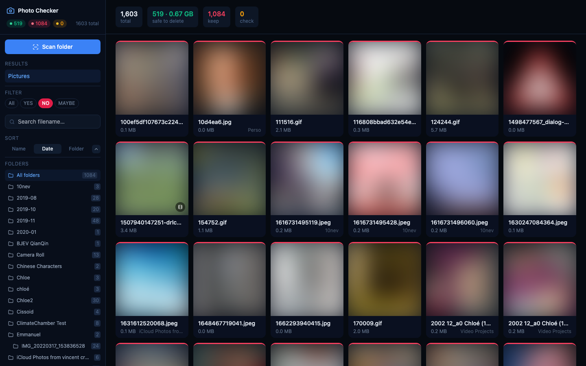
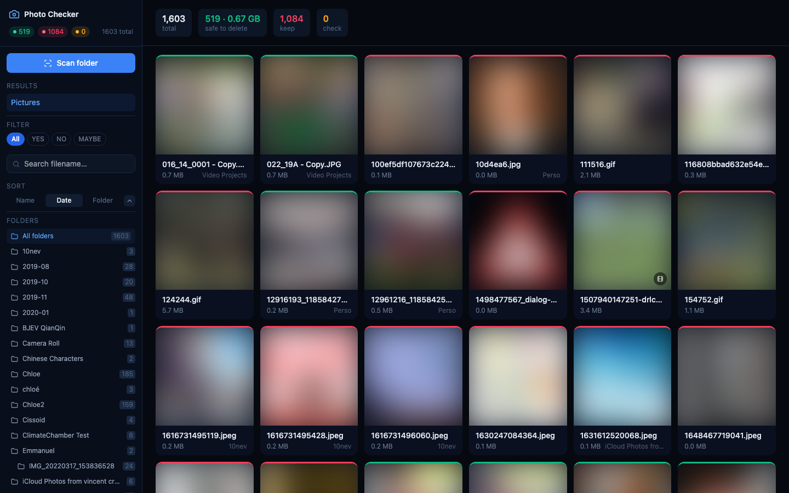
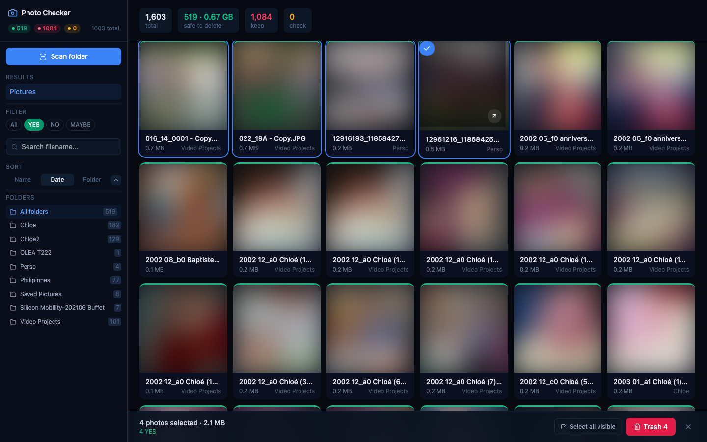
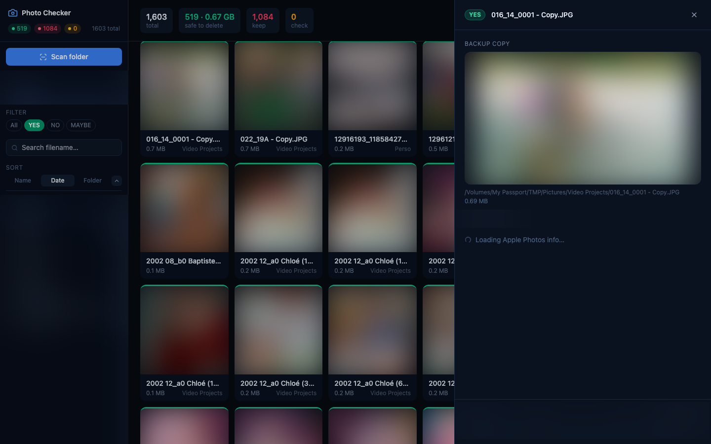

# Photo Checker

A macOS tool that scans a local folder of photos and checks — by filename — whether each file already exists in your cloud or local repositories, so you can safely delete confirmed duplicates.

## Screenshots

### Main grid — safe-to-delete files (YES filter)


### NO filter — files not found in any repository


### Full stats — all files


### Multi-select and batch actions


### Scan a new folder


### File detail panel


---

## What it does

- Scans a local folder (optionally recursive) and checks each photo by filename against:
  - **Apple Photos** ✅ — reads the local Photos library directly via `osxphotos` (no API, no network)
  - **Google Photos** 🚧 *(coming soon)* — API backend exists, UI integration in progress
  - **OneDrive** 🚧 *(coming soon)* — API backend exists, UI integration in progress
- Labels each file: `YES` (safe to delete — confirmed backup), `NO` (not found), `MAYBE` (found but a check errored)
- Lets you select files and **move to Trash** (`send2trash`), **import to Apple Photos**, or **force-move** to a folder
- Results are stored as JSON locally and browsable across sessions

---

## Architecture

```
photo_checker/
├── photo_checker.py      # Core scan logic (filename matching, Apple Photos via osxphotos)
├── api/
│   └── main.py           # FastAPI backend — scan, import, delete, thumbnails, Apple info
├── web/                  # Next.js 14 frontend (TypeScript, Tailwind)
│   ├── app/page.tsx      # Main page — grid, filters, batch selection
│   ├── components/
│   │   ├── Sidebar.tsx   # Results list, filters, sort, subfolder nav
│   │   ├── PhotoCard.tsx # Thumbnail card with selection
│   │   ├── DetailPanel.tsx  # Side panel — Apple Photos metadata, import button
│   │   ├── BatchBar.tsx  # Bottom bar — multi-select actions
│   │   └── ScanDialog.tsx   # Folder scan dialog
│   └── lib/
│       ├── api.ts        # Typed fetch wrappers
│       └── types.ts      # Shared TypeScript interfaces
├── results/              # Scan results (JSON, local only)
└── docs/screenshots/     # UI screenshots
```

**Runtime**: FastAPI serves both the API (`/api/*`) and the Next.js static build (`/`).  
**Dev**: Next.js dev server on `:3000` proxies API calls to FastAPI on `:8000`.

---

## Setup

### Requirements

- macOS (Apple Photos integration requires macOS)
- Python 3.10+
- Node.js 18+ (for frontend development only)

### Full Disk Access (required for Apple Photos)

`osxphotos` reads the Photos SQLite database directly. The app running the tool needs **Full Disk Access**:

| How you run it | App to grant access to |
|---|---|
| Terminal.app / iTerm2 | Terminal.app / iTerm2 |
| Via Claude Code in VS Code | Visual Studio Code |
| Via Claude desktop app | Claude.app |

**System Settings → Privacy & Security → Full Disk Access → add your terminal app**

### Install

```bash
git clone https://github.com/r45635/photo-checker
cd photo-checker

python3 -m venv venv
source venv/bin/activate
pip install -r requirements.txt        # FastAPI, osxphotos, Pillow, send2trash, …

cd web && npm install && npm run build # Build frontend
cd ..
```

### Config (for Google Photos / OneDrive)

```bash
mkdir -p ~/.photo_checker/tokens ~/.photo_checker/cache
```

Create `~/.photo_checker/config.json`:

```json
{
  "google_client_id": "YOUR_GOOGLE_CLIENT_ID",
  "google_client_secret": "YOUR_GOOGLE_CLIENT_SECRET",
  "onedrive_client_id": "YOUR_AZURE_APP_CLIENT_ID"
}
```

Apple Photos works with no config — it reads the local library directly.

---

## Run

```bash
# Production (serves web UI + API on port 8000)
source venv/bin/activate
python api/main.py
# → open http://localhost:8000

# Development (hot-reload frontend + API)
source venv/bin/activate
python -m uvicorn api.main:app --reload &   # API on :8000
cd web && npm run dev                        # UI on :3000 → open http://localhost:3000
```

---

## Usage

1. Click **Scan folder** → pick a folder path → optionally enable **Include subfolders** → **Scan**
2. Results appear in the grid. Use the filter bar (**YES / NO / MAYBE / ALL**) and subfolder list to navigate
3. Click any photo to open the **detail panel** — shows Apple Photos metadata (albums, date, cloud status) and an import button if not yet backed up
4. Check individual photos or use **shift-click** to range-select; the **batch bar** appears at the bottom
5. From the batch bar:
   - **Trash** — move confirmed YES files to macOS Trash (recoverable)
   - **Import** — send NO files to Apple Photos
   - **Force delete** — move or trash files without confirmed backup (requires typing `DELETE`)

---

## How matching works

Matching is **filename-based**, not hash-based — hashes change when metadata is edited; filenames are stable.

**Unicode normalization**: macOS filesystem paths come in NFD form; Apple Photos stores `original_filename` in NFC. The tool normalizes both sides to NFC before comparing, so filenames with accented characters (é, ü, ñ) match correctly.

**Fingerprint fallback**: for Apple Photos, the SHA-1 fingerprint stored in the Photos DB is checked as a secondary signal when the filename doesn't match (catches files that were renamed after import).

**`safe_to_delete = YES`** requires: found in ≥ 1 repository AND zero check errors.  
**`safe_to_delete = MAYBE`** = found somewhere but at least one check errored.

---

## Key design decisions

| Decision | Reason |
|---|---|
| Filename matching (not hash) | EXIF/tag edits change hashes; filenames are stable |
| Google Photos uses a local 24 h cache | The API has no filename search; listing everything once avoids thousands of paginated API calls |
| OneDrive uses per-file Graph search | `GET /me/drive/root/search(q='filename')` — acceptable for typical folder sizes |
| Deletion via `send2trash` | Never permanent; files land in macOS Trash and can be restored |
| `skip check duplicates true` in AppleScript import | Prevents Photos from showing a blocking dialog that would time out the API |
| Results stored as local JSON | No database dependency; easy to inspect and version-control |

---

## Tested

- Apple Photos: 37 000+ item library, 1 600-file scan folder, 402 confirmed duplicates detected
- Unicode normalization fix: 392 additional matches found after NFC normalization (files with accented names, e.g. Chloé)
